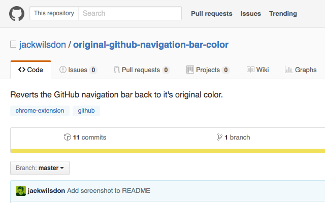

# Original GitHub Navigation Bar Color

A Chrome Extension that reverts the GitHub navigation bar back to it's original color. :octocat:

## Installing

You can install this extension by downloading the latest release from [here](https://github.com/jackwilsdon/original-github-navigation-bar-color/releases/latest) and then dragging it onto the Chrome "Extensions" page.
